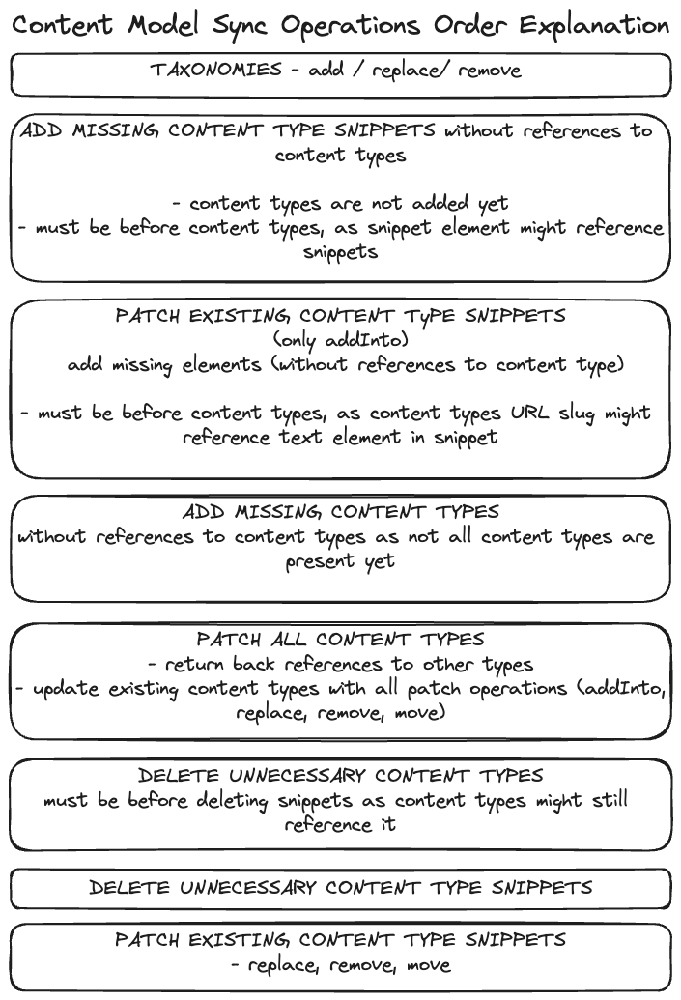
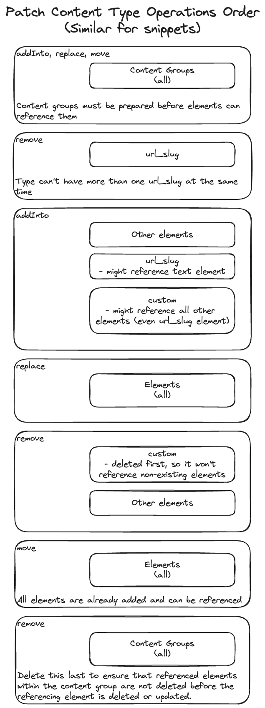

# Sync
> [!CAUTION] 
> Synchronizing content model might lead to irreversible changes to the environment such as:
> - Deletion of content by deleting elements from a content type
> - Deletion of used taxonomies

`Sync` command synchronizes the **source content model** into the **target environment** via [Kontent.ai Management API](https://kontent.ai/learn/docs/apis/openapi/management-api-v2/). The source content can be obtained from an existing Kontent.ai environment (considering you have access to the required credentials) or a folder structure in a required format (see [generate-sync-model](../generateSyncModel/README.md) command for more information). In the context of this command, the content model represents these entities: `Taxonomies`, `Content Types`, and `Content Type Snippets`. The command starts with the comparison of provided content models and creates patch operations that are printed out as the **environment diff**. We `ENCOURAGE` you to examine the changes before you proceed with the model synchronization. After the diff, a follow-up validation is performed to ensure the sync operation has a chance of success. Failing the validation might lead to a potential operation termination if an inconsistency is found. Otherwise, you will be asked to confirm the changes to begin the synchronization.

## Key principles
- Sync matches entities between the source and the target models via a `codename`.
- If the model contains `guidelines` that reference content items or assets that are not present in the target environment, they will be referenced by their `externalId`(if externalId is non-existent `id` is used as `externalId`) after the synchronization. Don't forget to migrate the missing content to the target environment afterwards (or even better, beforehand) to achieve the desired results. 
- If `Linked items` or `Rich text element` references non-existent content types, they will be referenced using the `externalId` (entity `codename` or a combination of multiple entities `codenames` is used as `externalId`) after the synchronization.
  
## Sync conditions
To successfully synchronize the content model, we introduced a couple of conditions your environment **must follow** before attempting the sync:
- There mustn't be an entity with the same codename but different externalId in source and target content models - checked by validation.
- There mustn't be an operation that changes the content type or content type snippet's element type - checked by validation.
- There mustn't be an operation deleting a used content type (there is at least one content item of that type) - checked by validation.
- Source content model mustn't reference a deleted taxonomy group.
- If providing source content model via a folder, you must ensure that the content model is in a valid state - not checked by validation!
- Both environments must have the same status of Web Spotlight (either activated, or deactivated).

## Usage
```bash
npx @kontent-ai/data-ops export --targetEnvironmentId=<target-environment-id> --targetApiKey=<target-management-API-key> --sourceEnvironmentId=<source-environment-id>
--sourceApiKey=<source-api-key>
```
OR

```bash
npx @kontent-ai/data-ops export --targetEnvironmentId=<target-environment-id> --targetApiKey=<target-management-API-key> --folderName=<path-to-content-folder>
```

> [!NOTE]  
> As the command might get long, we recommend passing parameters in a JSON configuration file (e.g. --configFile params.json)
> ```JSON
> // params.json example
> {
>   "targetApiKey": "<target-mapi-key>",
>   "targetEnvironmentId": "<target-env-id>",
>   "sourceEnvironmentId": "<source-env-id>",
>   "sourceApiKey": "<source-mapi-key>"
> }
> ```

To see all supported parameters, run `npx @kontent-ai/data-ops sync --help`.

## Known limitations
Using Management API introduces some limitations. Synchrozining content model won't let you:
- Change the state of Web Spotlight (coming soon)
- Snippet element can't be referenced in the same request its created in. Because of this, the tool can't move it to the correct place in the content type.

## Contributing

When syncing the content model, add, patch, and delete operations must come in a specific order, otherwise, MAPI won't be able to reference some entities. Check the image below for more details.



To successfully patch a content type, its operations for content groups and elements must also be in a specific order:



