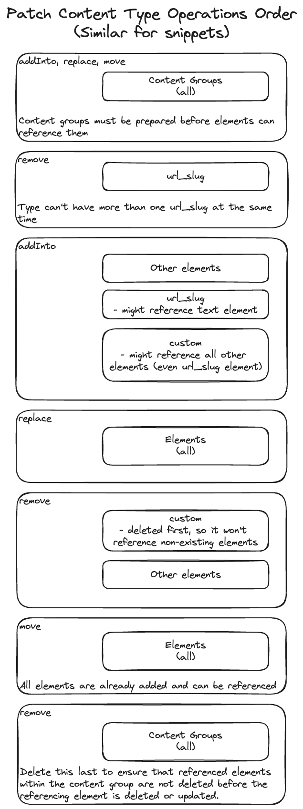

# Sync Run Command

> [!CAUTION]
>
> Synchronizing a content model & environment metadata can lead to irreversible changes in the target environment, such as:
>
> - **Deletion of content** by removing elements from content types.
> - **Deletion of used taxonomies**.
> - **Removal of role limitations** in workflows (see [Known Limitations](#known-limitations)).
>
> Proceed with caution and consider testing in a non-production environment first!

The `sync run` command is capable of synchronizing the **source content model & environment metadata** into the **target environment** using the [Kontent.ai Management API](https://kontent.ai/learn/docs/apis/openapi/management-api-v2/). This command is essential for maintaining consistency across environments (e.g., Development, Staging, Production) by updating mainly the content model in the target environment to match the source.

## Why Use `sync run`?

- **Environment Consistency**: Ensure that your content model is identical across environments, preventing issues caused by discrepancies.
- **Deployment Automation**: Automate content model updates as part of your CI/CD pipeline.
- **Team Collaboration**: Allow multiple team members to work on a content model across different environments and synchronize changes efficiently.

## Source Data Options

You can obtain the source data in two ways:

1. **From an Existing Kontent.ai Environment**: Provide the source environment ID and Management API key to fetch the content model & environment metadata directly.
2. **From a Local Folder**: Use a local folder containing a created snapshot using the [`sync snapshot`](../snapshot/README.md) command.

## Key Features

- **Selective Synchronization**: Specify which entities to synchronize using the mandatory `--entities` parameter.
- **Pre-Sync Validation**: Data-ops automatically performs validation checks to prevent operations that could cause errors or data loss.
- **Change Preview (Diff)**: Each run displays a set of patch operations that will be performed on the target environment, allowing you to review and confirm the changes about to be made.

## Supported Entities

The following entities can be synchronized:

- **Content Types**
- **Content Type Snippets**
- **Taxonomies**
- **Web Spotlight**
- **Asset Folders**
- **Collections**
- **Spaces**
- **Languages**
- **Workflows**

To successfully sync your environments, ensure your MAPI keys have the necessary permissions. For more information about API keys, visit our [learn portal](https://kontent.ai/learn/docs/apis/openapi/management-api-v2/#tag/API-keys).

> [!NOTE]
> To sync Web Spotlight settings, your MAPI keys must have the Manage Environments permission enabled.

## Important Considerations

- **Entity Matching**: Entities are matched by their `codename`.
- **Partial Synchronization**: Ensure all dependent entities are included or already exist in the target environment.
- **No External ID Synchronization**: `external_id` properties are not synchronized to avoid conflicts.
- **Guidelines References and Linked Item Default References**: References to items or assets not present in the target environment will use `external_id` after synchronization.
- **References to Unknown Content Types**: If Linked items or Rich text element references non-existent content types, they will be referenced using the external_id after the synchronization (one or more entity codenames are used to form the external_id).


## Conditions for Successful Synchronization

Before running the synchronization, ensure:

- **No Element Type Changes**: Changing the type of an existing element is not allowed.
- **No Deletion of Used Content Types**: Cannot delete content types with existing content items.
- **No Deletion of Used Collections**: Cannot delete collections containing content items.
- **No References to Deleted Taxonomies**: The source model should not reference deleted taxonomies.
- **Valid Content Model**: If using a folder, ensure the content model files are valid and correctly structured.

## Known Limitations

- **Snippet Elements**: Cannot reference snippet elements in the same request they're created. Because of this, the tool can't move it to the correct place in the content type.
- **Asset Folders**:
  - Cannot be moved; they are deleted and recreated if structure differs.
  - Cannot be deleted if containing assets; ensure folders to be deleted are empty.
- **Languages**: cannot be deleted, instead, they are deactivated. Their name and codename are replaced with the first 8 characters of a randomly generated UUID (name and codename have a limit of 25 characters).
- **Roles and Workflows**:
  - Roles cannot be added or updated via the API.
  - Role assignments in workflows cannot be synchronized; role restrictions are lost when updating workflows.

## Usage

To see all supported parameters, run:

```bash
npx @kontent-ai/data-ops@latest sync run --help
```

### Synchronizing directly between Environments

```bash
npx @kontent-ai/data-ops@latest sync run \
  --targetEnvironmentId=<target-env-id> \
  --targetApiKey=<target-api-key> \
  --sourceEnvironmentId=<source-env-id> \
  --sourceApiKey=<source-api-key> \
  --entities contentTypes contentTypeSnippets taxonomies
```
### Synchronizing from a Local Snapshot (Recommended)

First, create the snapshot:

```bash
npx @kontent-ai/data-ops@latest sync snapshot \
  --environmentId=<source-env-id> \
  --apiKey=<source-api-key> \
  --outputFolder=./content-model \
  --entities contentTypes contentTypeSnippets taxonomies
```

Then, synchronize to the target environment:

```bash
npx @kontent-ai/data-ops@latest sync run \
  --targetEnvironmentId=<target-env-id> \
  --targetApiKey=<target-api-key> \
  --folderName=./content-model \
  --entities contentTypes contentTypeSnippets taxonomies
```


### Using a Configuration File

Create a `params.json` file:

```json
{
  "targetEnvironmentId": "<target-env-id>",
  "targetApiKey": "<target-api-key>",
  "folderName": "./content-model",
  "entities": [
    "contentTypes",
    "contentTypeSnippets",
    "taxonomies",
    "collections",
    "assetFolders",
    "spaces",
    "languages",
    "webSpotlight",
    "workflows"
  ]
}
```

Run the command with the configuration file:

```bash
npx @kontent-ai/data-ops@latest sync run --configFile params.json
```

### Parameters

| Parameter                | Description                                                                                                  |
|--------------------------|--------------------------------------------------------------------------------------------------------------|
| `--targetEnvironmentId`  | The ID of the target environment where the content model will be synchronized.                               |
| `--targetApiKey`         | The Management API key for the target environment.                                                           |
| `--sourceEnvironmentId`  | (Optional) The ID of the source environment to fetch the content model from.                                 |
| `--sourceApiKey`         | (Optional) The Management API key for the source environment.                                                |
| `--folderName`           | (Optional) Path to the folder containing the exported content model.                                         |
| `--entities`             | List of entities to synchronize (`contentTypes`,`contentTypeSnippets`,`taxonomies`,`collections`,`assetFolders`,`spaces`,`languages`,`webSpotlight`,`workflows`).                                        |
| `--skipConfirmation`     | (Optional) Skip confirmation message.                                                                        |
| `--configFile`           | (Optional) Path to a JSON configuration file containing parameters.                                          |

> [!NOTE]
> Use either `--sourceEnvironmentId` and `--sourceApiKey`, or `--folderName`, not both.

## Sync Environments Programmatically

You can synchronize your environments within your scripts using the `syncRun` function:

```typescript
import { syncRun, SyncRunParams } from "@kontent-ai/data-ops";

const params: SyncRunParams = {
  targetEnvironmentId: "<target-env-id>",
  targetApiKey: "<target-api-key>",
  // Use either sourceEnvironmentId and sourceApiKey, or folderName
  // sourceEnvironmentId: "<source-env-id>",
  // sourceApiKey: "<source-api-key>",
  folderName: "./content-model",
  entities: {
    contentTypes: () => true, // Synchronize all content types
    taxonomies: (taxonomy) => taxonomy.codename.startsWith('category_'), // Synchronize specific taxonomies
    languages: (language) => language.codename === "default" // Synchronize only the default language
  }
};

await syncRun(params);
```

### Advanced Filtering

When synchronizing programmatically, you can provide custom filter functions for each entity type:

```typescript
entities: {
  contentTypes: (contentType) => contentType.codename !== 'obsolete_type',
  taxonomies: (taxonomy) => taxonomy.terms.length > 0,
  // Other entities...
}
```

## Summary

- **Review Changes**: Always review the diff generated before synchronization to understand the changes that will be applied.
- **Backup**: Consider exporting the target environment's content model before synchronization as a backup.
- **Testing**: Test the synchronization in a non-production environment to ensure it behaves as expected.
- **Dependencies**: Ensure that all dependencies (e.g., referenced taxonomies, content types) are included or exist in the target environment.

## Troubleshooting

- **Validation Errors**: If synchronization fails due to validation errors, check the error messages and ensure all conditions are met.
- **Missing Dependencies**: Ensure all dependent entities are included or exist in the target environment.
- **API Rate Limits**: Be aware of Kontent.ai API rate limits when synchronizing large content models.

---
## Contributing

To successfully patch a content type, its operations for content groups and elements must be in a specific order:



### Taxonomy Diff Handler

Taxonomies are handled as a flat array of terms with each term having an additional property `position` that encodes its position in the tree.

The `position` property is an array of term codenames starting from the term's parent up to the root term (a taxonomy group child).

Since the terms are flattened in pre-order (parent is before its children), moving a term into an added term is not an issue, as the parent term will be processed before the moved term (added first).

Similarly, remove operations in the array handler are added at the end, so moving a term from a removed term is also not a problem.
