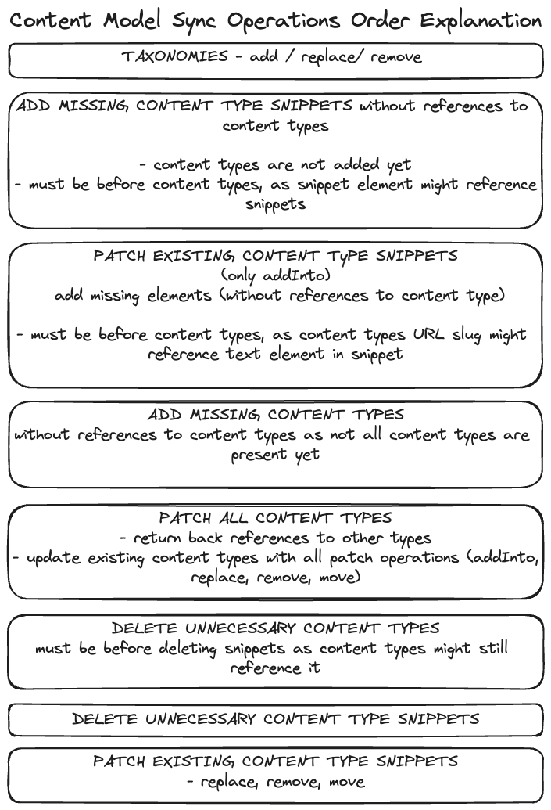

# sync-model run

> [!CAUTION] 
> Synchronizing content model might lead to irreversible changes to the environment such as:
> - Deletion of content by deleting elements from a content type
> - Deletion of used taxonomies

The `sync-model run` command synchronizes the **source content model** into the **target environment** via [Kontent.ai Management API](https://kontent.ai/learn/docs/apis/openapi/management-api-v2/). The source content can be obtained from an existing Kontent.ai environment (considering you have access to the required credentials) or a folder structure in a required format (see [sync-model export](../export/README.md) command for more information).

In the context of this command, the content model is represented by the following entities: `Taxonomies`, `Content Types`, and `Content Type Snippets`. The command begins by comparing the provided content models and generates patch operations, which are then printed as the **environment diff**.  

**We strongly encourage you to examine the changes before you proceed with the model synchronization.** Following the diff, a validation is performed to ensure the sync operation can succeed. Should the validation find any inconsistencies, the operation may be terminated. Otherwise, you will be asked to confirmation in order to begin the synchronization.

## Key principles
- Sync matches entities between the source and the target models via a `codename`.
- The command does not sync `external_id` properties of content model entities (existing `external_id` cannot be changed and can conflict with other entities). 
- If the model contains `guidelines` that reference content items or assets that are not present in the target environment, they will be referenced by their `external_id`(if externalId is non-existent `id` is used as `external_id`) after the synchronization. Remember to migrate any missing content to the target environment either beforehand (preferably) or afterwards to achieve the desired results.
- If `Linked items` or `Rich text element` references non-existent content types, they will be referenced using the `external_id` after the synchronization (one or more entity `codenames` are used to form the `external_id`).
  
## Sync model conditions
To successfully synchronize the content model, we introduced a couple of conditions your environment **must follow** before attempting the sync:
- There mustn't be an operation that changes the content type or content type snippet's element type - checked by validation.
- There mustn't be an operation deleting a used content type (there is at least one content item of that type) - checked by validation.
- Source content model mustn't reference a deleted taxonomy group - not checked by validation!
- If providing source content model via a folder, you must ensure that the content model is in a valid state - not checked by validation!
- Both environments must have the same status of Web Spotlight (either activated, or deactivated) - not checked by validation!

## Usage
```bash
npx @kontent-ai/data-ops@latest sync-model run --targetEnvironmentId=<target-environment-id> --targetApiKey=<target-management-API-key> --sourceEnvironmentId=<source-environment-id>
--sourceApiKey=<source-api-key>
```
OR

```bash
npx @kontent-ai/data-ops@latest sync-model run --targetEnvironmentId=<target-environment-id> --targetApiKey=<target-management-API-key> --folderName=<path-to-content-folder>
```

> [!NOTE]  
> As the command might get long, we recommend passing parameters in a JSON configuration file (e.g. --configFile params.json)
> ```JSON
> {
>   "sourceEnvironmentId": "<source-env-id>",
>   "sourceApiKey": "<source-mapi-key>",
>   "targetEnvironmentId": "<target-env-id>",
>   "targetApiKey": "<target-mapi-key>"
> }
> ```

To see all supported parameters, run `npx @kontent-ai/data-ops@latest sync-model run --help`.

### Sync model programmatically

To sync model in environments in your scripts, use `syncModelRun` function:

```ts
import { syncModelRun, SyncModelRunParams } from "@kontent-ai/data-ops";

const params: SyncModelRunParams = {
  sourceEnvironmentId: "<source-env-id>",
  sourceApiKey: "<source-mapi-key>",
  targetEnvironmentId: "<target-env-id>",
  targetApiKey: "<target-mapi-key>"
};

await syncModelRun(params);
```

## Known limitations
Using Management API introduces some limitations:
- Snippet element can't be referenced in the same request it's created in. Because of this, the tool can't move it to the correct place in the content type.

## Contributing

When syncing the content model, add, patch, and delete operations must come in a specific order, otherwise, MAPI won't be able to reference some entities. Check the image below for more details.



To successfully patch a content type, its operations for content groups and elements must also be in a specific order:


### Taxonomy diff handler

Taxonomies are handled as a flat array of terms with each term having an additional property `position` that encodes its position in the tree.
The `position` property is an array of term codenames starting from the term's parent up to the root term (a taxonomy group child).

Since the terms are flattened in pre-order (parent is before its children), moving a term into an added term is not an issue, as the parent term will be processed before the moved term (added first). 

Similarly, remove operations in the array handler are added at the end, so moving a term from a removed term is also not a problem.
